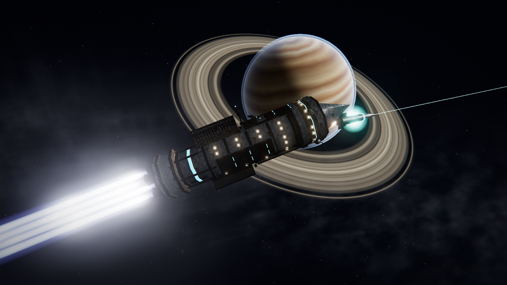
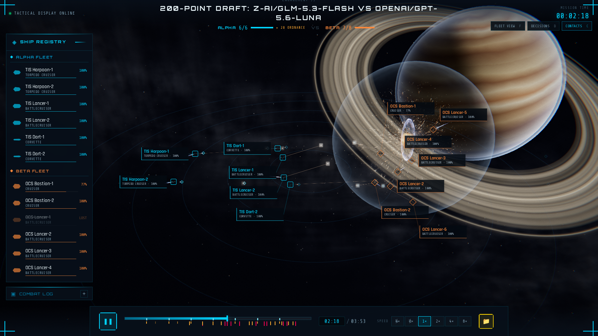
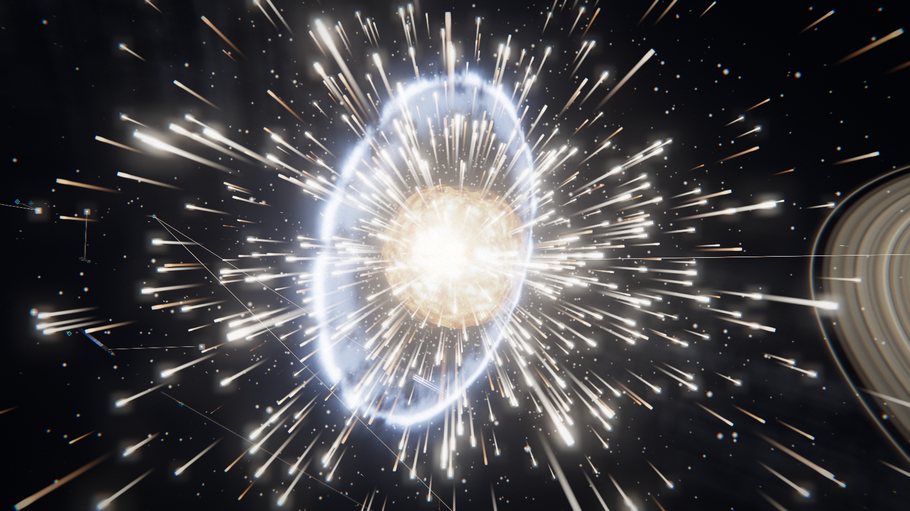
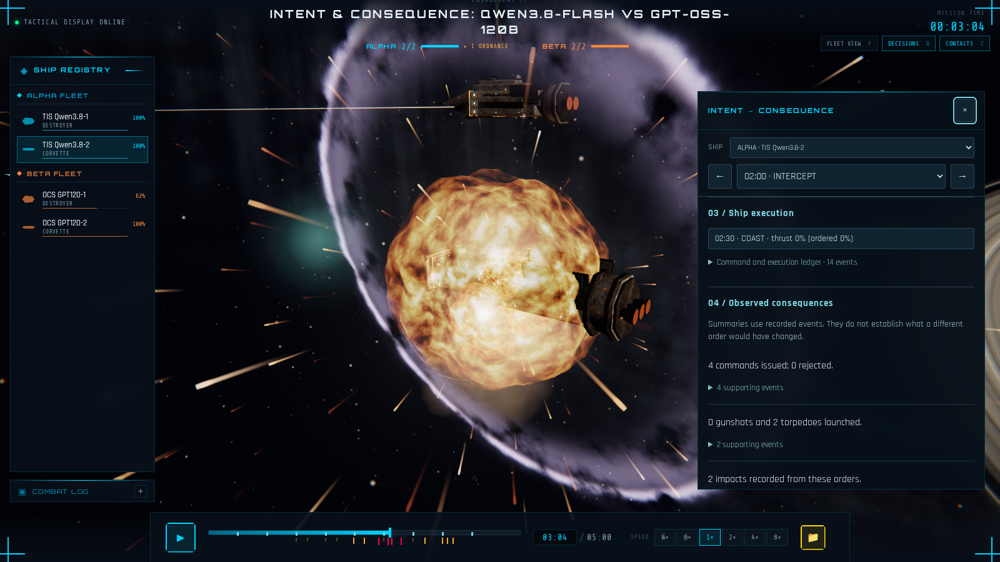
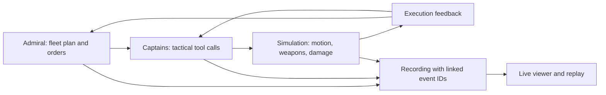

# AI Commanders

**Give two AI admirals a fleet budget. Let them pick their ships, make a plan, and live with the consequences.**

AI Commanders is a Terra Invicta-inspired space combat simulator where language models command ships through tactical tools. Admirals coordinate fleets, captains handle their own ships, and a Python simulation resolves the maneuvers, coilgun fire, torpedo salvos, heat, armor damage, and eventual wreckage.

Watch the battle in a 3D live viewer, then rewind it to follow an order from the commander's intent to the impact it caused. The commanders can also negotiate, argue with their admiral, keep notes, and talk far too much trash for people surrounded by vacuum.



*An actual frame from GLM 5.3 Flash vs GPT-5.6 Luna. All screenshots below come from the replay viewer.*

[Watch a replay](#watch-a-replay) · [Run a live battle](#run-a-live-battle) · [Recorded battles](#recorded-battles) · [How it works](#how-it-works) · [Development](#development)

## What you can do

- **Let the models build their own fleets.** Give both admirals a point budget and ship limit. Each independently chooses a composition and places its starting formation in 3D.
- **Watch different command styles collide.** Use one model throughout a fleet, separate admiral and captain models, free heuristic captains, or an MCP client controlling a side directly.
- **Follow intent into consequences.** Inspect model inputs, public responses, tool calls, accepted and rejected commands, queued launches, actual execution, and linked impacts.
- **Watch live or explore a recording.** Fleet framing, ship cameras, tactical contacts, predicted live paths, a combat log, and a scrubbable timeline share the same viewer.
- **Fight with finite resources.** Acceleration, turning, propellant, magazines, capacitor charge, heat, and exposed armor facings all affect the outcome.
- **Run without paid models.** Browse the included recordings or generate battles with deterministic heuristic captains.

## Watch a replay

The fastest way to try the project needs **Node.js and npm**, a WebGL-capable browser, and **no API key**.

```bash
git clone https://github.com/paulmch/ai-commanders.git
cd ai-commanders

mkdir -p visualizer/public/recordings
cp data/recordings/intent_*.json visualizer/public/recordings/
cp data/recordings/glm_luna_200pt_live_20260906/battle_glm_5_3_flash_vs_gpt_5_6_luna_20260906_140449.json \
  visualizer/public/recordings/glm_luna_200pt_live_20260906.json

cd visualizer
npm ci
npm run dev
```

Open **[the GLM–Luna replay](http://localhost:5173/?recording=/recordings/glm_luna_200pt_live_20260906.json)**. Or open [localhost:5173](http://localhost:5173) and choose any recording JSON from `data/recordings/` with the file selector.



*Fleet view keeps the formations, incoming ordnance, and ship condition in view. Select a ship to get closer.*

### Viewer controls

| Control | Action |
| --- | --- |
| **Space** | Play or pause |
| **← / →** | Seek backward or forward five seconds |
| **F** | Frame the active fleets |
| **D** | Open or close intent and consequence |
| **C** | Toggle tactical contact labels |
| Click a ship or its registry entry | Select and focus it |
| Drag / scroll | Orbit / zoom |
| Timeline or time input | Seek to an exact moment |
| **FOLLOW** button | Return to following the live battle |

The viewer includes nine procedural hull designs, articulated turrets, finned radiators and coolant pipes, fusion exhaust, point-defense beams, torpedo trails, and destruction that reconstructs correctly when you scrub backward. Ships can become drifting, burning hulks before their reactors detonate.



*The destruction is part of the recording: the camera can move, but the event stays tied to battle time.*

## Run a live battle

For simulation and model calls, install **Python 3.10+** and **uv**. From the repository root:

```bash
uv sync --locked --all-extras
```

Add your key to a local `.env` file, which is ignored by Git:

```dotenv
OPENROUTER_API_KEY=your-key-here
```

Start the viewer in one terminal with `cd visualizer && npm run dev`. In another terminal, from the repository root:

```bash
uv run python scripts/run_live_draft_battle.py \
  --alpha-model z-ai/glm-5.3-flash \
  --beta-model openai/gpt-5.6-luna \
  --points 200 \
  --max-ships 8 \
  --turns 40 \
  --spend-limit 8
```

Open **[the live viewer](http://localhost:5173/?live=1&decisions=1)** before the draft finishes. It shows draft progress, then switches to the battle automatically.

| Setting | Behavior |
| --- | --- |
| Fleet selection | Both admirals independently buy ships and place formations |
| Commanders | Each captain uses its faction's model; the admiral issues fleet and individual orders |
| Model settings | High reasoning, up to 8,192 output tokens per request, text observations |
| Decision timing | 30 simulated seconds per turn; the final turn gets its execution window too |
| Starting range | Fleet anchors begin 500 km apart; formations offset individual ships |
| End conditions | Up to 40 turns; elimination, surrender, or an agreed draw can end it earlier |
| Spending | One $8 ceiling shared by drafting, battle calls, and retries |
| Recording | Progress saved after each turn; full simulation frames and decision evidence |

The first decision follows a 30-second opening coast, so this setup allows up to **1,230 simulated seconds**. Model calls take wall-clock time: **“Waiting for AI commanders” is a decision phase**, while the spectator server stays responsive.

The launcher checks OpenRouter's model catalog, reserves costs before requests, and applies provider price ceilings. The dollar limit is a ceiling, not a price estimate. If it is reached, the runner stops and preserves the partial replay. Model availability, supported reasoning settings, and rates depend on the provider.

Completed replays are staged under `visualizer/public/recordings/`. Drafts, configuration, the battle archive, and a continuously updated spending report live under `data/recordings/<run name>/`. The server stays available after the battle, and the same live link becomes a replay. Use `--no-linger` to close it on completion.

[Full live and replay guide →](docs/intent-replays.md)

### Try a free live battle

This uses automatic fleet selection and heuristic captains, with no model calls:

```bash
uv run python scripts/run_live_draft_battle.py \
  --offline --points 200 --max-ships 8 --turns 10
```

Use the same live viewer link. Run one battle server at a time on the default port, 8765.

## From intent to consequence

An order is only the beginning. A captain can ask for a salvo while launchers are reloading, turn away from a target while its guns wait for an angle, or launch a torpedo that hits several decisions later.

The **Decisions** panel connects those steps:

1. **Intent:** the admiral's directive and orders, the captain's public response and tool calls, and the exact recorded model inputs.
2. **Execution:** what the engine accepted, queued, rejected, or actually executed, with feedback on helm and weapon behavior.
3. **Consequence:** launches, misses, interceptions, impacts, module losses, and unresolved ordnance linked back to their originating decisions.



*In the Qwen–GPT-OSS replay, a corvette's orders at 02:00 lead to impacts at 02:55 and 03:04. Click the evidence to follow the chain.*

Summaries use recorded events and only reveal evidence available at the current playhead. Optional model commentary is labeled **Model interpretation**; cited event IDs are validated. Legacy recordings still show the orders and context they contain. Captains and admirals receive execution feedback in their next prompts, so the same evidence also helps them adjust during a battle.

After staging the sample recordings, [open that corvette decision](http://localhost:5173/?recording=/recordings/intent_qwen_gptoss.json&decisions=1&ship=alpha_2&decision=e152&t=184).

## Recorded battles

These are individual matches with specific fleets and settings, not a model leaderboard. Costs below are the reported usage for those runs on September 6, 2026.

| Match | What happened | Reported cost | Recording |
| --- | --- | ---: | --- |
| **GLM 5.3 Flash vs GPT-5.6 Luna** | Independent 200-point drafts; GLM eliminated Luna's fleet at 233 seconds, after seven turns | **$0.1946** | [Replay](data/recordings/glm_luna_200pt_live_20260906/battle_glm_5_3_flash_vs_gpt_5_6_luna_20260906_140449.json) · [Drafts](data/recordings/glm_luna_200pt_live_20260906/battle_glm_5_3_flash_vs_gpt_5_6_luna_20260906_140449.draft.json) |
| **Qwen 3.8 Flash vs GPT-OSS 120B** | Two ships per side; Qwen won on tactical score at 300 seconds | $0.0691 | [Replay](data/recordings/intent_qwen_gptoss.json) |
| **DeepSeek V3.2 vs GPT-4.1 mini** | Three ships per side; GPT-4.1 mini won on tactical score at 360 seconds | $0.1406 | [Replay](data/recordings/intent_deepseek_mini.json) |
| **Heuristic vs heuristic** | Free mixed-fleet example of the execution evidence | $0 | [Replay](data/recordings/intent_heuristic.json) |

GLM bought **two torpedo cruisers, two battlecruisers, and two corvettes** for 198 points. Luna spent all 200 points on **two cruisers and six battlecruisers**. Their formations and chosen doctrines are preserved alongside the replay.

The two smaller model trials include optional commentary calls in their costs. [Usage details](docs/replay-trial-results.json) · [GLM–Luna run report](data/recordings/glm_luna_200pt_live_20260906/status.json) · [Older battles and commander dialogue](docs/battle-stories.md)

## How it works



**Admirals** see fleet state and motion snapshots, maintain a standing battle plan, issue a fleet directive and orders to individual ships, and can communicate with the opposing admiral. Optional tactical images are available in fleet modes that enable admiral vision.

**Captains** receive their own state, contacts, admiral orders, and execution feedback. Their tools match their hull's equipment. They choose targets, maneuvers, firing policies, torpedo launches, radiator state, and communications. They can discuss orders with their admiral and keep a private log for later turns.

**The simulation** advances between decisions. Coasting preserves momentum; turning and acceleration take time. Ballistic rounds inherit their launcher's velocity. Guided torpedoes have finite fuel, can lose their seekers to point defense, and can retarget reachable enemies when their original target dies. Armor is divided into nose, lateral, and tail facings, with penetration damaging internal modules.

It is a tactical game simulation: ordinary steps are one second, and gun hit resolution includes a probabilistic dispersion model. A fixed seed reproduces combat randomness for identical commands; it does not make live model responses deterministic. [Physics and targeting audit](docs/project-audit-2026-09-06.md)

### Nine ship classes

| Class | Draft points | Role |
| --- | ---: | --- |
| Frigate | 7 | Fast, lightly armored gunboat |
| Corvette | 17 | Fast torpedo boat |
| Destroyer | 18 | General-purpose gun platform |
| Battlecruiser | 24 | Fast capital gunship |
| Cruiser | 28 | Heavier armored gunship |
| Battleship | 42 | Line-of-battle capital |
| Dreadnought | 53 | Heavy fleet anchor |
| Siege dreadnought | 54 | Dreadnought with a siege spinal weapon |
| Torpedo cruiser | 58 | Four launchers, deep magazines, and escort point defense |

Costs are derived from the current ship data and scoring formula. [Ship reference](docs/ships.md) · [Draft rules and cost model](docs/draft_mode.md)

## Other ways to play

### Duels and configured fleets

Generate an offline duel:

```bash
uv run python scripts/run_llm_battle.py \
  --alpha-model heuristic --beta-model heuristic \
  --alpha-ship-type destroyer --beta-ship-type corvette \
  --seed 42 --max-checkpoints 10 --trace --no-personality-selection
```

For a configured model fleet battle, edit an [example fleet configuration](data/fleet_config_example.json), including its model IDs, then run:

```bash
uv run python scripts/run_llm_battle.py \
  --fleet-config data/fleet_config_example.json --trace
```

Fleet JSON supports per-ship models, optional admirals, positions and velocities, a decision interval of 20–60 seconds, a time limit, checkpoint limit, seed, and recording options. Explicit CLI settings override the corresponding JSON settings. These general launchers do not provide the live draft runner's dollar ceiling.

The [standard draft launcher](scripts/run_draft_battle.py) also supports separate admiral and captain models, heuristic crews, optional vision, and automatic drafts. Check each command's `--help` for its options.

### Control a fleet through MCP

An MCP client can command one or both sides, including fleet selection and formation placement. MCP-controlled sides make no OpenRouter calls through this project; any model usage in the external client is separate.

```bash
uv run python scripts/mcp_battle.py \
  --config data/fleet_config_mcp_draft.json \
  --draft-budget 200 --draft-max-ships 8
```

This example gives the MCP-controlled Alpha side an automatic, heuristic opponent. Connect the client, draft a fleet, and signal `ready()` to advance. The same live viewer can spectate.

[Client configuration, tools, and battle flow →](docs/mcp-battles.md)

### Commander memory and learning

Admirals maintain a standing plan and captains keep log notes within a battle. Cross-battle learning is opt-in: `scripts/refine_commander.py` distills proposed notebook lessons from recordings, then tests them in rematches with and without the lesson. Accepted entries can be injected with `--notebooks` in the general battle launchers.

Notebook injection is off by default, including in the budgeted live draft runner. [The Notebook Wars](docs/battle-stories.md#battle-results-the-notebook-wars---sonnet-5-vs-deepseek-v4-flash-2026-08-11) show why a lesson that sounds sensible still needs to survive another battle.

## Development

```bash
uv sync --locked --all-extras
uv run pytest tests/ -q

cd visualizer
npm ci
npm test
npm run build
```

The September 6 pass verified **1,695 Python tests and 15 viewer tests**, plus the production viewer build, seeded simulation comparisons, and live/replay browser checks.

For screenshots, install Playwright's browser once, stage a recording as above, then capture a frame:

```bash
uv run playwright install chromium
uv run python scripts/viewer_snapshot.py \
  --recording glm_luna_200pt_live_20260906.json \
  --time 100 --focus alpha_1 --dist 2.2 --out /tmp/cruiser.png
```

The screenshot helper starts a local viewer if needed, or reuses the running one. It also supports explicit camera placement, hidden UI, and destruction sequences. [README screenshot sources](docs/images/readme/README.md)

| Location | Contents |
| --- | --- |
| `src/simulation.py`, `src/physics.py` | Combat loop and ship motion |
| `src/llm/` | Captains, admirals, tools, drafts, recording, budgets, MCP |
| `src/replay_evidence.py` | Command and ordnance execution provenance |
| `visualizer/src/` | Three.js scene, replay loader, controls, decision and contact panels |
| `scripts/` | Battle launchers, analysis tools, screenshot capture |
| `data/fleet_ships.json` | Ship and equipment specifications |
| `data/recordings/` | Archived battles and draft evidence |
| `tests/`, `visualizer/tests/` | Simulation and viewer regressions |

Useful reading: [intent replays](docs/intent-replays.md), [draft mode](docs/draft_mode.md), [admiral vision](docs/admiral_vision.md), and the [project audit](docs/project-audit-2026-09-06.md). The [original architecture notes](docs/architecture/) are historical design documents; the implementation has since evolved.

Contributions are welcome. Include a reproducible scenario for simulation changes, and before/after screenshots for visual changes.

## Attribution and license

Inspired by **Terra Invicta**, developed by Pavonis Interactive and published by Hooded Horse. Ship data and combat parameters were translated from the game's data; this project implements its own simulation, model integration, and viewer.

Project code is licensed under the [MIT License](LICENSE).
